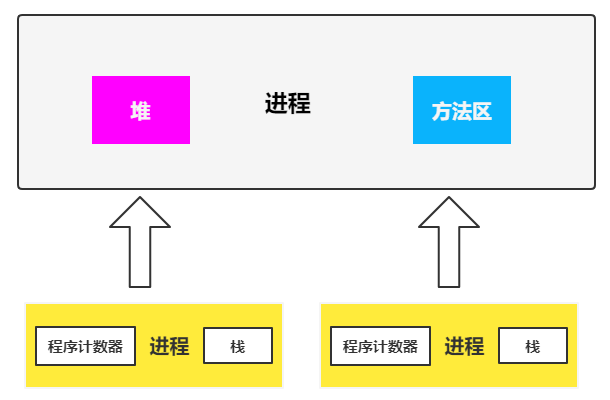
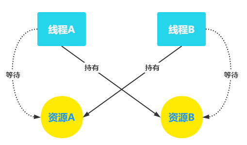

# 一、并发编程线程基础篇

## 1. 并发编程基础

### 1.1 什么是线程

**进程：**

1. 系统进行资源分配和调度的基本单位
2. 一个进程至少有一个线程
3. 进程中的多个线程共享进程的资源

**线程：**

1. CPU分配资源的基本单位
2. 每个线程有自己的程序程序计数器和栈区域

**进程与线程关系图：**

**堆：** 【线程共享】进程中最大的一块内存，存放使用`new`操作创建的对象实例

**栈：** 【线程私有】存储该线程的局部变量、线程的调用栈帧

**方法区：** 【线程共享】存放JVM加载的类、常量及静态变量等信息

### 1.4 join方法

1. 无参, 无返回值
2. Thread 提供的线程等待方法
3. 等待所属线程执行完毕再往下执行

### 1.9 死锁(DeadLock)

**死锁：** 两个或两个以上的线程在执行过程中，因争夺资源而造成相互等待的现象（如图）

> 线程A持有资源B, 还想请求资源A  
> 线程B持有资源A, 还想请求资源B  
> 线程A和线程B因为相互等待对方已经持有的资源而陷入了死锁

**死锁产生必备条件（4个）** 

- **互斥条件：** 一个资源被一个线程独占，其他线程请求该资源只能等待
- **请求并持有条件：** 一个线程至少持有一个独占资源，请求新的被独占资源，从而陷入等待，同时不释放自身的资源
- **不可剥夺条件：** 一个线程持有的资源不能被其他线程抢夺，只能由自身释放
- **环路等待条件：** 发生死锁时，必然存在线程→资源的环形链，即线程集合{T1,T2,...Tn}，T1等待T2占用的资源，T2等待Tn占用的资源

**如何避免死锁**   
- 破坏至少一个构造死锁的必要条件，目前只有【请求并持有】和【环路等待条件】可以被破坏
- **有序性原则：** 如果线程A、B都需要资源1、2、3，对资源进行排序，线程A、B只有在获取了资源n-1才能去获取资源n，即获取了资源1才能获取资源2

### 1.11 ThreadLocal

> 多线程访问或者对同一个共享变量进行写入时，特别容易出现并发问题  
> 因此为了保证线程安全问题，一般使用者在访问共享变量时需要进行适当的同步  
> 同步的方式一般是加锁，而ThreadLocal可以实现每个线程对一个变量访问的时候，访问的是自己线程的变量 

**ThreadLocal工作原理** 
- ThreadLocal是JDK提供的线程本地变量
- 如果你创建了一个ThreadLocal变量，那么访问这个变量的每个线程都会有一个这个变量的本地副本
- 当多个线程操作这个变量时，实际操作的是线程自己内存中的副本，避免了线程安全问题  

**ThreadLocal使用注意**  
- 每个线程的本地变量存在自身的内存变量threadLocals中
- 如果当前线程一直不消亡，这些变量会一直存在，可能造成内存溢出
- 所以使用完毕后需要调用`remove`方法删除对应线程threadLocals中的本地变量

**继承**
- ThreadLocal不支持继承：父线程的ThreadLocal无法被子线程继承使用
- InheritableThreadLocal支持继承：父线程的InheritableThreadLocal可以被子线程继承使用

## 2. 并发编程基础其他知识

