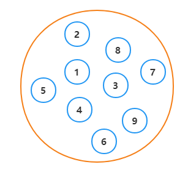
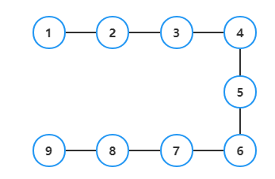
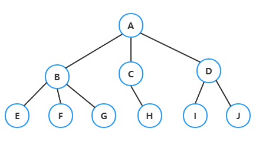
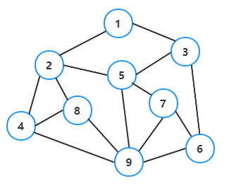
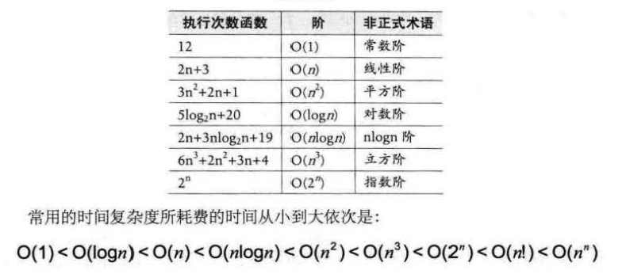

下载
> https://www.lanzouw.com/iIzwzwjramf  
> 密码:5q5t

## 一、绪论

### 1. 基本概念和术语

**数据：** 是描述客观事物的符号，是计算机中可操作的对象，是能被计算机识别，并输入给计算机处理的符号集合  
**数据元素：** 是组成数据的、有一定意义的基本单位，在计算机中通常作为整体处理，也被成为记录  
**数据项：** 一个数据元素可以由若干个数据项组成  
**数据对象：** 是性质相同的数据元素的集合，是数据的子集  
**数据结构：** 是相互之间存在一种或多种特定关系的数据元素的集合

### 2. 逻辑结构和物理结构

**2.1 逻辑结构：** 是指数据对象中数据元素之间的相互关系  
1）集合结构：集合结构中的数据元素除了同属于一个集合外，他们之间没有其他关系  
  
2）线性结构：线性结构中的数据元素之间是一对一的关系  
  
3）树形结构：树形结构中的数据元素之间存在一对多的层次关系  
  
4）图形结构：图形结构中的数据元素是多对多的关系  

**2.2 物理结构：** 是指数据的逻辑结构在计算机中的存储形式 1）顺序存储结构：是把数据元素存放在地址连续的存储单元里，其数据间的逻辑和物理关系是一致的  
2）链式存储结构：是把数据元素存放在任意的存储单元里，这组存储单元可以是连续的，也可以是不连续的

### 3. 抽象数据类型

**数据类型：** 是指一组性质相同的值的集合及定义在此集合上的一些操作的总称  
**抽象数据类型：** 是指一个数学模型及定义在该模型上的一组操作

## 二、算法

### 1. 算法的特性

**1.1 输入输出：** 算法具有零个或多个输入，算法至少有一个输出或多个输出  
**1.2 有穷性：** 指算法在执行有限的步骤之后，自动结束而不会出现无限循环，并且每一个步骤在可接受的时间内完成  
**1.3 确定性：** 算法的每一个步骤都具有确定的意义，不会出现二义性  
**1.4 可行性：** 算法的每一步都是可行的，也就是说，每一步都能够通过执行有限的次数完成

### 2. 算法的设计要求

**2.1 正确性：** 指算法至少应该具有输入、输出和加工处理无歧义性、能正确反应问题的需求、能够得到问题的正确答案

> **算法的四个层次**
> 1. 算法没有语法错误
> 2. 算法程序对于合法的输入数据能够产生满足要求的输出结果
> 3. 算法程序对于非法的输入数据能够产生满足要求的输出结果
> 4. 算法程序对于精心挑选的，甚至刁难的测试数据都有满足要求的输出结果
>
> 总结：由于证明层次4的代价非常昂贵，一般情况，层次3作为一个算法是否正确的标准

**2.2 可读性：** 算法设计的另一目的是为了便于阅读、理解和交流  
**2.3 健壮性：** 当输入数据不合法时，算法也能做出相关处理，而不是产生异常或莫名其妙的结果  
**2.4 时间效率高和存储量低：** 设计算法应尽量满足时间效率高和存储量低的需求

### 3. 函数的渐近增长

**函数的渐近增长：**
> &nbsp;&nbsp;&nbsp;&nbsp;给定两个函数f(n)和g(n),如果存在一个整数N,使得对于所有n>N, f(n)总是比g(n)大,那么,我们说f(n)的增长渐近快于g(n)  
> &nbsp;&nbsp;&nbsp;&nbsp;判断一个算法时,函数中的常数和其他次要项常常可以忽略,而更应该关注主项(最高阶项)的阶数

### 4. 算法的时间复杂度

**算法时间复杂度定义：**
> &nbsp;&nbsp;&nbsp;&nbsp;在进行算法分析时，语句总的执行次数T(n)是关于问题规模n的函数,进而分析T(n)随n的变化情况并确定T(n)的数量级.  
> &nbsp;&nbsp;&nbsp;&nbsp;算法的时间复杂度,也就是算法时间度量,记作：`T(n) = O(f(n))` 它表示随问题规模n的增大,算法执行时间的增长率相同,称作算法的渐近时间复杂度, 简称时间复杂度.  
> &nbsp;&nbsp;&nbsp;&nbsp;其中f(n)是问题规模n的某个函数

**推导大O阶方法：**
> 1. 用常数1取代运行时间中的所有加法常数
> 2. 在修改后的运行次数函数中,只保留最高阶项
> 3. 如果最高阶项存在且不是1,则去除与这个项相乘的常数
>
> 得到的结果就是大O阶

**常数阶：** `O(1)`  
**线性阶：** `O(n)`  
**对数阶：** `O(logn)`  
**平方阶：** `O(n^2)`

**常见的时间复杂度：**

> 由于O(n^3)往后, 过大的n会使结果变得不现实, 一般我们都不去讨论

**最坏情况和平均情况：** 最坏情况运行时间是一种保证,在应用中,这是一种最重要的需求,通常,除非特别指定,我们提到的运行时间都是最坏情况的运行时间

### 5. 算法的空间复杂度

**空间复杂度计算公式：** `S(n)=O(f(n))` 其中n为问题的规模, `f(n)`为语句关于n所占存储空间的函数

## 三、线性表

### 1. 线性表的定义

**线性表(List)：** 零个或多个数据元素的有限序列
> 线性表中的数据是一对一的关系,按序排成一队

### 2. 线性表的抽象数据类型

**线性表的基本操作**
> *L：需要返回的对象, L：需要操作的对象, e：需要操作的元素, *e：需要返回的元素
> 1. `InitList(*L)`：初始化操作,建立一个空的线性表
> 2. `ListEmpty(L)`：若线性表为空, 返回true,否则返回false
> 3. `ClearList(*L)`：将线性表清空
> 4. `GetElem(L, i, *e)`：将线性表中的第`i`个元素直接返回给`e`
> 5. `LocateElem(L, e)`：在线性表`L`中查找于给定值`e`相等的元素,若查找成功,返回该元素在表中序号表示成功,否则返回0表示失败
> 6. `ListInsert(*L, i, e)`：在线性表`L`的第`i`个位置插入`e`
> 7. `ListEelete(*L, i, *e)`：删除线性表`L`的第`i`个位置元素, 并用`e`返回其值
> 8. `ListLength(L)`：返回线性表`L`的元素个数

### 3. 线性表的存储结构

**3.1 顺序存储结构：** 指的是用一段地址连续的存储单元，依次存储线性表的数据元素  
**3.2 链式存储结构：** 指的是用一组任意的存储单元存储线性表的数据元素
> 1) 单链表
> 2) 静态链表
> 3) 循环链表
> 3) 双向链表

## 四、栈与队列

### 1. 栈

**1.1 栈的定义：** 是限定在表尾进行插入和删除操作的线性表
> 【先进后出 / 后进先出】  
> 栈的插入`(push)`操作，叫作进栈，也称压栈、入栈  
> 栈的删除`(pop)`操作，叫作出栈，也有人叫作弹栈

**1.2 栈的存储结构：** 下标为0的一端作为栈底`(top)`，通常把空栈的判定条件定位`top=-1`